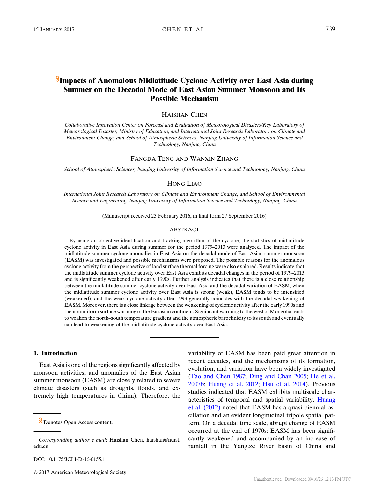
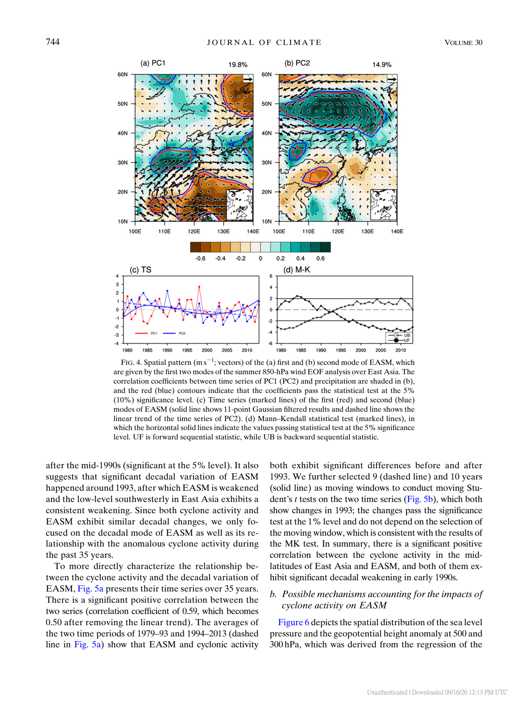
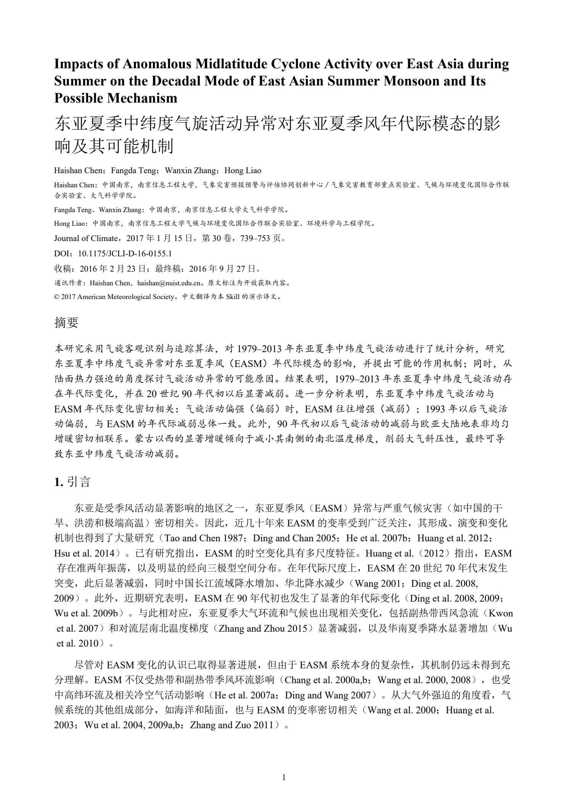
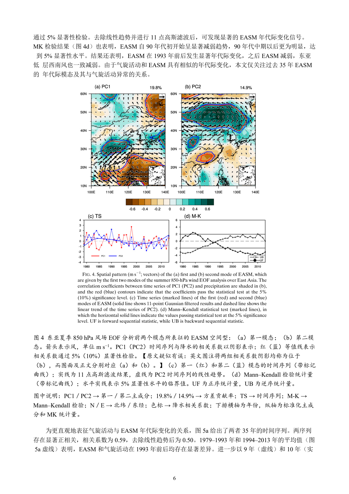

# 项目名称：文献翻译skill

1、 项目介绍：

太长不看省流版：
把外文文献翻译成能直接打印的中文文献，PDF格式。

以下以陈海山校长（2017）关于东亚夏季中纬度气旋与东亚夏季风的论文为例，展示完整页面的翻译与排版效果。

| 图 1：英文原文标题页 | 图 2：英文原文正文示例页 |
| :---: | :---: |
| [](docs/images/demo-original-title.png) | [](docs/images/demo-original-figure4.png) |
| 图 3：中文译文标题页 | 图 4：中文译文正文示例页 |
| [](docs/images/demo-translated-title.png) | [](docs/images/demo-translated-figure4.png) |

图 1、2 为文献原文，图 3、4 为中文译文。中文采用单栏排版，保留原图及英文图注，并补充中文图注和独立的“图中说明”。上表的演示图片编号与论文内部图号分别计数；点击图片可查看大图。

[英文原文 PDF](examples/east-asian-summer-monsoon/clim-jcli-d-16-0155.1.pdf) · [完整中文译文 PDF](examples/east-asian-summer-monsoon/clim-jcli-d-16-0155.1_zh-CN.pdf)

详细介绍：
这是一个给科研小白用的翻译文献+排版 skill。输入是待翻译的外文文献，输出是排版好的PDF格式的中文译文，并且对文献的插图做了专门的处理。如果是小众专业，可以跟随原文文献一起上传翻译词典。
能够保留高分辨率的插图，并且不影响正文。


2、 开发初衷：

作者是南京龙王山皇家气象学院的一名大气科学专业的24级本科生，相比于电脑屏幕，更喜欢纸质化的资料。但大气科学专业的文献大多是电子的，翻译软件也是电子的，且目前没有找到一个很好的一键式翻译软件能够翻译英文文献并处理图表。因此想着一不做二不休，干脆自己用Codex写一个skill得了。于是就有了这个项目。

3、 其他信息：

如果想商用（虽然不知道这么个简单的项目为什么会有商用）联系我邮箱即可。
如果想与我交流科研心得（或者明日方舟扩列、二次元、徒步佬、胶佬、篮球、园艺扩列），欢迎直接加我QQ：3635316706

4、 项目后续：
现在这个skill的翻译还是略微有些慢，我想要寻找一些现有的翻译平台接入，提高skill运行速度，并节约Token。
现在skill对词典的适配度还不是很好，因为缺少案例。如果有人有现有词典，或者有好的解决方案，欢迎与我交流！


问题反馈：QQ：3635316706

# 希望这个skill能帮到你！
# 祝科研顺利！


本skill主要部分由Codex + GPT-6 Astra开发

作者：HouMD

联系邮箱（含商业授权申请）：13918343664@163.com

---

# translate-paper-pdf

将英文科研论文 PDF 翻译并重新排版为中文 PDF 的 Codex 技能。面向通用科研领域，支持可选专业词典和联网术语核实，重视全文完整性、图表清晰度与翻译疑点说明。

本项目包含技能指令、处理规范和可移植的Python排版／检查模块，由具备文件读取、代码执行和联网能力的AI完成翻译与审校。模块不调用翻译平台，尚不是独立的一键翻译程序。

## 功能

- 按原文阅读顺序翻译摘要、正文及其他实质内容，采用中文单栏排版，参考文献保留英文。
- 图表默认以 600 dpi 无损裁剪，必要时提高分辨率；保留原英文图注、表注及原印刷尺寸。
- 图表下方提供中文翻译，“图中说明”另起一行；公式及编号保留原样。
- 正文宋体、摘要及图表说明等楷体，西文默认 Times New Roman；五号字为主，可读性优先。
- 对实质歧义、原文疑似错误或无法辨认之处，用【】首次标注。
- 保留可编辑译文、裁剪图和排版材料，便于后续修订。

## 安装与调用

将完整的 `translate-paper-pdf` 文件夹放入目标项目的 `.agents/skills/`，保持以下结构；若下载后的文件夹名称带有分支后缀，调整为 `translate-paper-pdf`：

```text
<项目根目录>/
└─ .agents/skills/translate-paper-pdf/
   ├─ SKILL.md
   ├─ README.md
   ├─ LICENSE
   ├─ .gitignore
   ├─ scripts/
   │  ├─ paper_pdf.py
   │  ├─ paperpdf/
   │  ├─ requirements.txt
   │  └─ tests/regression.py
   └─ references/
      ├─ layout-and-review.md
      ├─ preflight-and-reliability.md
      └─ portable-module.md
```

在该项目的 Codex 对话中加载技能后，提供 PDF 附件或文件路径并调用：

```text
使用 $translate-paper-pdf，将附件中的英文论文完整翻译成中文 PDF。
```

可选专业词典和方向：

```text
使用 $translate-paper-pdf 翻译 papers/example.pdf。
专业方向：大气科学。
词典：papers/术语表.xlsx。
```

相对路径以当前工作目录为基准。技能名称是对话中的调用方式，不是终端命令。无需提供词典也可以使用；专业方向不明确时，AI 会按需询问。

修订时说明对应论文、页码、具体问题和期望效果即可。完整执行规则见 [SKILL.md](SKILL.md)。

## 输入与输出

必需输入为英文科研论文 PDF。可选输入包括专业词典、术语表、专业方向和其他明确要求。扫描件需要文字识别，效果受原件清晰度影响。

默认每篇论文单独保存到当前项目的 `TRANSLATIONS/<论文简称>/`；没有项目时以当前工作目录为基准，也可指定其他输出位置：

```text
TRANSLATIONS/<论文简称>/
├─ 英文原文.pdf
├─ 中文译文_v1.pdf
└─ tmp/
   ├─ 可编辑译文与内容块
   ├─ 裁剪及排版代码
   ├─ 图表裁剪与页面预览
   └─ 术语与检查记录
```

顶层仅放原文与交付 PDF，代码及其他过程材料全部进入 `tmp`。不自动删除原文或过程文件。

## 环境要求

- 能加载本技能并读取本地文件、执行代码、联网查证的 AI 环境。
- 可用的 PDF 提取、渲染与排版工具。执行时先检测环境，例如可使用 pdfplumber/pypdf、PDFium/Poppler、ReportLab 等组合；这些不是需要全部安装的固定清单。
- 可合法使用并嵌入的宋体、楷体和 Times New Roman 字体；本仓库不附带字体文件。缺少指定字体时，需要提供字体或确认替代字体。
- 扫描件需要可用的 OCR 能力。

环境路径通过当前环境检测或用户配置获得，技能不绑定个人盘符、用户名、字体目录或插件安装路径。具体预检见 [首次生成的预防规则](references/preflight-and-reliability.md)。

附带模块使用ReportLab、pypdf、pdfplumber、pypdfium2与Pillow，依赖范围见`scripts/requirements.txt`；优先使用已有环境。配置格式及`preflight / crop / build / verify / render / review / delivery`命令见 [可移植模块说明](references/portable-module.md)。模块通过结构化图注、标点换行检查和上下标核验减少返工，通过内容缓存减少重复裁剪和渲染；首次全文翻译与逐页检查仍需执行。

## 已验证情况与限制

此前已在 Windows 环境完成一篇 13 页、双栏排版的大气科学论文试译，生成 15 页中文 PDF，并核对 10 幅图、1 张表、4 个公式和 32 条英文参考文献。排版与核验逻辑已提取为独立模块，配套合成回归测试验证路径迁移、换行、上下标、图像身份／尺寸及验收失效机制。

本仓库现提供 [Chen 等（2017）的演示案例](examples/README.md)：15 页英文原文翻译为 16 页中文 PDF，保留 11 幅图、2 个编号公式和 58 条英文参考文献，完成文字一致性、图像身份与原尺寸核验及逐页目检。本次按本地演示要求未进行联网术语核实。原文中发现的图注、年份及符号疑点已在译文对应位置标注。本仓库不包含商业字体，翻译中间材料保留在本地 `tmp/` 并由 `.gitignore` 排除。

其他操作系统、专业方向和复杂扫描件尚未逐一实测。提高截图分辨率不能恢复原图缺失的细节；原文自身的错误和歧义也不能靠翻译自动消除。译文仍需结合原文审阅。该流程包含预防性检查和逐页验收，不承诺任意 PDF 一次通过。

排版与验收要求见 [排版与检查规则](references/layout-and-review.md)。

## 反馈

可通过仓库 Issues 或 README 顶部的邮箱反馈。请尽量说明使用环境、问题所在页码、实际结果和期望结果；提供最小必要片段前，请确认有权分享相关材料。

## 许可证与商业使用

本项目采用 CC BY-NC 4.0 许可协议。商业使用请通过本 README 公布的邮箱联系作者，取得单独的书面授权。

许可全文见 [LICENSE](LICENSE)，中文说明见 [CC BY-NC 4.0 官方页面](https://creativecommons.org/licenses/by-nc/4.0/deed.zh-hans)。非商业使用、分享和修改须遵守该协议，包括适用的署名、提供许可链接和标明修改等要求。

本项目属于源文件公开、商业使用受限的项目，不应标为 OSI 意义上的开源软件；参见 [Open Source Definition 第 6 条](https://opensource.org/osd)。许可证仅涵盖本项目材料，不授予第三方论文、图表或字体的权利。
